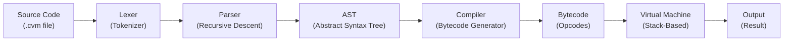
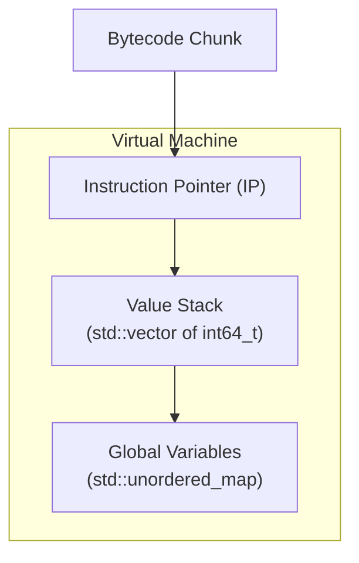

# CVM++ — Complete Project Roadmap

> **Stack-Based Virtual Machine & Custom Compiler in C++**

---

## 📌 Project Overview

Build a lightweight, custom scripting language in C++ that:
1. **Lexes** raw source code into tokens
2. **Parses** tokens into an Abstract Syntax Tree (AST)
3. **Compiles** the AST into proprietary bytecode (opcodes)
4. **Executes** the bytecode on a custom stack-based Virtual Machine

---

## 🏗️ High-Level Architecture



---

## 📂 Recommended Project Structure

```
cvm++/
├── CMakeLists.txt              # Build configuration
├── README.md
├── include/
│   ├── lexer.h                 # Lexer class declarations
│   ├── token.h                 # Token types & Token struct
│   ├── ast.h                   # AST node definitions
│   ├── parser.h                # Parser class declarations
│   ├── compiler.h              # Bytecode compiler declarations
│   ├── opcode.h                # Opcode enum definitions (ISA)
│   ├── vm.h                    # Virtual Machine declarations
│   └── value.h                 # Runtime value type (int, bool)
├── src/
│   ├── main.cpp                # Entry point — REPL or file runner
│   ├── lexer.cpp               # Lexer implementation
│   ├── parser.cpp              # Parser implementation
│   ├── compiler.cpp            # Compiler implementation
│   └── vm.cpp                  # VM implementation
├── tests/
│   ├── test_lexer.cpp          # Lexer unit tests
│   ├── test_parser.cpp         # Parser unit tests
│   ├── test_compiler.cpp       # Compiler unit tests
│   └── test_vm.cpp             # VM integration tests
└── scripts/
    ├── hello.cvm               # Sample: print("Hello CVM!")
    ├── arithmetic.cvm          # Sample: math operations
    ├── variables.cvm           # Sample: variable assignment
    ├── control_flow.cvm        # Sample: if/else, while loops
    └── fibonacci.cvm           # Sample: fibonacci sequence
```

---

## 🗓️ Phase-by-Phase Roadmap

---

### Phase 0 — Setup & Foundations (Day 1–2)

> [!TIP]
> Get comfortable with the tools and concepts before writing any compiler code.

#### Tasks
- [ ] Set up C++ development environment (g++/clang++, VSCode/CLion)
- [ ] Initialize Git repository
- [ ] Set up CMake build system (optional but recommended)
- [ ] Read Chapters 1–4 of *Crafting Interpreters* by Robert Nystrom
- [ ] Understand the pipeline: **Source → Tokens → AST → Bytecode → VM**

#### CMakeLists.txt Starter

```cmake
cmake_minimum_required(VERSION 3.15)
project(CVMPlusPlus LANGUAGES CXX)

set(CMAKE_CXX_STANDARD 17)
set(CMAKE_CXX_STANDARD_REQUIRED ON)

add_executable(cvm
    src/main.cpp
    src/lexer.cpp
    src/parser.cpp
    src/compiler.cpp
    src/vm.cpp
)

target_include_directories(cvm PRIVATE include)
```

#### ✅ Milestone: Project compiles and runs a "Hello World" main.cpp

---

### Phase 1 — Language Design & Grammar (Day 3–4)

> [!IMPORTANT]
> The language grammar drives EVERYTHING — lexer, parser, compiler. Design it first.

#### Define the CVM Language Grammar (BNF-style)

```
program        → statement* EOF

statement      → letStmt
               | printStmt
               | inputStmt
               | ifStmt
               | whileStmt
               | exprStmt

letStmt        → "let" IDENTIFIER "=" expression ";"
printStmt      → "print" expression ";"
inputStmt      → "input" IDENTIFIER ";"
ifStmt         → "if" "(" expression ")" block ( "else" block )?
whileStmt      → "while" "(" expression ")" block
exprStmt       → expression ";"
block          → "{" statement* "}"

expression     → assignment
assignment     → IDENTIFIER "=" expression | equality
equality       → comparison ( ("==" | "!=") comparison )*
comparison     → term ( ("<" | ">" | "<=" | ">=") term )*
term           → factor ( ("+" | "-") factor )*
factor         → unary ( ("*" | "/") unary )*
unary          → ("-" | "!") unary | primary
primary        → NUMBER | "true" | "false" | IDENTIFIER | "(" expression ")"
```

#### Supported Data Types
| Type | Examples | Internal Representation |
|------|----------|------------------------|
| Integer | `0`, `42`, `-7` | `int64_t` |
| Boolean | `true`, `false` | `bool` (stored as int: 1/0) |

#### Supported Operators
| Category | Operators |
|----------|-----------|
| Arithmetic | `+`, `-`, `*`, `/` |
| Comparison | `==`, `!=`, `<`, `>`, `<=`, `>=` |
| Logical | `!` (unary NOT) |
| Assignment | `=` |

#### Sample CVM Script (`hello.cvm`)
```
let x = 10;
let y = 20;
let sum = x + y;
print sum;

if (sum > 25) {
    print 1;
} else {
    print 0;
}

let i = 0;
while (i < 5) {
    print i;
    i = i + 1;
}
```

#### ✅ Milestone: Language grammar documented, sample scripts written

---

### Phase 2 — Lexer / Tokenizer (Day 5–8)

> Convert raw source code string → array of Tokens

#### Token Types to Define (`token.h`)

```cpp
enum class TokenType {
    // Literals
    NUMBER,         // 42, 100
    TRUE_KW,        // true
    FALSE_KW,       // false
    IDENTIFIER,     // x, sum, myVar

    // Operators
    PLUS,           // +
    MINUS,          // -
    STAR,           // *
    SLASH,          // /
    EQUAL,          // =
    EQUAL_EQUAL,    // ==
    BANG,           // !
    BANG_EQUAL,     // !=
    LESS,           // <
    LESS_EQUAL,     // <=
    GREATER,        // >
    GREATER_EQUAL,  // >=

    // Delimiters
    LPAREN,         // (
    RPAREN,         // )
    LBRACE,         // {
    RBRACE,         // }
    SEMICOLON,      // ;

    // Keywords
    LET,            // let
    PRINT,          // print
    INPUT,          // input
    IF,             // if
    ELSE,           // else
    WHILE,          // while

    // Special
    EOF_TOKEN,      // End of file
    ERROR           // Invalid token
};

struct Token {
    TokenType type;
    std::string lexeme;     // The raw text of the token
    int line;               // Line number for error reporting
};
```

#### Lexer Implementation Steps
1. **Create `Lexer` class** — takes a `std::string` source input
2. **Implement `scanToken()`** — reads one token at a time
3. **Handle whitespace & comments** — skip spaces, tabs, newlines; optionally support `//` comments
4. **Scan single-char tokens** — `+`, `-`, `*`, `/`, `(`, `)`, `{`, `}`, `;`
5. **Scan two-char tokens** — `==`, `!=`, `<=`, `>=` (peek-ahead logic)
6. **Scan numbers** — read consecutive digits into a NUMBER token
7. **Scan identifiers & keywords** — read alpha strings, check against keyword map
8. **Track line numbers** — increment on `\n` for error messages
9. **Return `EOF_TOKEN`** at end of input

#### Pseudocode for Main Scan Loop

```
while not at end:
    skip whitespace
    mark start position
    read character c

    if c is digit → scanNumber()
    if c is alpha → scanIdentifier() → check if keyword
    if c is '='  → peek next: '=' → EQUAL_EQUAL, else EQUAL
    if c is '!'  → peek next: '=' → BANG_EQUAL, else BANG
    if c is '<'  → peek next: '=' → LESS_EQUAL, else LESS
    if c is '>'  → peek next: '=' → GREATER_EQUAL, else GREATER
    if c is single-char operator → return corresponding token
    else → ERROR token

return EOF_TOKEN
```

#### Testing the Lexer
```
Input:  "let x = 10 + 20;"
Output: [LET, IDENTIFIER("x"), EQUAL, NUMBER(10), PLUS, NUMBER(20), SEMICOLON, EOF]
```

#### ✅ Milestone: Lexer correctly tokenizes all sample `.cvm` scripts

---

### Phase 3 — Parser & AST (Day 9–14)

> Convert array of Tokens → Abstract Syntax Tree (AST)

#### AST Node Definitions (`ast.h`)

```cpp
// Base node
struct ASTNode {
    virtual ~ASTNode() = default;
};

// Expressions
struct NumberLiteral : ASTNode {
    int64_t value;
};

struct BoolLiteral : ASTNode {
    bool value;
};

struct Identifier : ASTNode {
    std::string name;
};

struct UnaryExpr : ASTNode {
    TokenType op;                           // MINUS or BANG
    std::unique_ptr<ASTNode> operand;
};

struct BinaryExpr : ASTNode {
    TokenType op;                           // PLUS, MINUS, STAR, etc.
    std::unique_ptr<ASTNode> left;
    std::unique_ptr<ASTNode> right;
};

struct AssignExpr : ASTNode {
    std::string name;
    std::unique_ptr<ASTNode> value;
};

// Statements
struct LetStmt : ASTNode {
    std::string name;
    std::unique_ptr<ASTNode> initializer;
};

struct PrintStmt : ASTNode {
    std::unique_ptr<ASTNode> expression;
};

struct InputStmt : ASTNode {
    std::string variableName;
};

struct IfStmt : ASTNode {
    std::unique_ptr<ASTNode> condition;
    std::vector<std::unique_ptr<ASTNode>> thenBranch;
    std::vector<std::unique_ptr<ASTNode>> elseBranch;  // may be empty
};

struct WhileStmt : ASTNode {
    std::unique_ptr<ASTNode> condition;
    std::vector<std::unique_ptr<ASTNode>> body;
};

struct Block : ASTNode {
    std::vector<std::unique_ptr<ASTNode>> statements;
};
```

#### Parser Implementation — Recursive Descent

Each grammar rule becomes a function:

```
parseProgram()      → calls parseStatement() in a loop
parseStatement()    → checks current token, dispatches to:
    parseLetStmt()
    parsePrintStmt()
    parseInputStmt()
    parseIfStmt()
    parseWhileStmt()
    parseExprStmt()
parseExpression()   → calls parseEquality()
parseEquality()     → calls parseComparison(), checks ==, !=
parseComparison()   → calls parseTerm(), checks <, >, <=, >=
parseTerm()         → calls parseFactor(), checks +, -
parseFactor()       → calls parseUnary(), checks *, /
parseUnary()        → checks -, !, then calls parsePrimary()
parsePrimary()      → NUMBER, TRUE, FALSE, IDENTIFIER, (expression)
```

#### Key Parser Methods

```cpp
class Parser {
    std::vector<Token> tokens;
    int current = 0;

    Token peek();           // Look at current token without consuming
    Token advance();        // Consume and return current token
    bool check(TokenType);  // Check if current token matches type
    bool match(TokenType);  // If match, advance and return true
    Token consume(TokenType, std::string errorMsg);  // Expect & consume
    void error(std::string msg);  // Report parse error with line number
};
```

#### Testing the Parser
```
Input Tokens: [LET, ID("x"), EQUAL, NUMBER(10), PLUS, NUMBER(20), SEMICOLON]

Output AST:
  LetStmt {
    name: "x",
    initializer: BinaryExpr {
      op: PLUS,
      left: NumberLiteral { value: 10 },
      right: NumberLiteral { value: 20 }
    }
  }
```

> [!TIP]
> Add a debug mode that prints the AST tree structure (use indentation to show nesting). This is a deliverable!

#### ✅ Milestone: Parser builds correct ASTs for all sample scripts, debug print works

---

### Phase 4 — Instruction Set Architecture / ISA (Day 15–16)

> Design the bytecode opcodes your VM will execute

#### Opcode Definitions (`opcode.h`)

```cpp
enum class OpCode : uint8_t {
    // Stack Operations
    OP_CONSTANT,     // Push a constant value onto the stack
    OP_POP,          // Pop top of stack (discard)

    // Arithmetic
    OP_ADD,          // Pop two, push sum
    OP_SUBTRACT,     // Pop two, push difference
    OP_MULTIPLY,     // Pop two, push product
    OP_DIVIDE,       // Pop two, push quotient
    OP_NEGATE,       // Pop one, push negated value

    // Comparison
    OP_EQUAL,        // Pop two, push bool (a == b)
    OP_NOT_EQUAL,    // Pop two, push bool (a != b)
    OP_LESS,         // Pop two, push bool (a < b)
    OP_GREATER,      // Pop two, push bool (a > b)
    OP_LESS_EQUAL,   // Pop two, push bool (a <= b)
    OP_GREATER_EQUAL,// Pop two, push bool (a >= b)

    // Logical
    OP_NOT,          // Pop one, push logical NOT

    // Boolean Literals
    OP_TRUE,         // Push true (1)
    OP_FALSE,        // Push false (0)

    // Variables
    OP_SET_GLOBAL,   // Pop value, store in variable (operand = name index)
    OP_GET_GLOBAL,   // Push variable value onto stack (operand = name index)

    // Control Flow
    OP_JUMP,         // Unconditional jump (operand = offset)
    OP_JUMP_IF_FALSE,// Pop condition; jump if false (operand = offset)

    // I/O
    OP_PRINT,        // Pop top of stack and print it
    OP_INPUT,        // Read integer from stdin, push onto stack

    // Program
    OP_HALT,         // Stop execution
};
```

#### Bytecode Chunk Structure

```cpp
struct Chunk {
    std::vector<uint8_t> code;        // The bytecode stream
    std::vector<int64_t> constants;   // Constant pool
    std::vector<std::string> names;   // Variable name pool

    int addConstant(int64_t value);   // Returns index
    int addName(const std::string& name); // Returns index
    void emit(OpCode op);
    void emit(OpCode op, uint8_t operand);
    void emit(OpCode op, uint16_t operand);  // For jumps (2-byte offset)
};
```

#### Execution Flow Example

```
Source:     let x = 10 + 20;
Bytecode:  OP_CONSTANT 0    (push 10)
           OP_CONSTANT 1    (push 20)
           OP_ADD           (pop 20 & 10, push 30)
           OP_SET_GLOBAL 0  (pop 30, store in variable "x")
```

#### ✅ Milestone: ISA fully designed and documented

---

### Phase 5 — Bytecode Compiler (Day 17–22)

> Walk the AST → emit bytecode into a Chunk

#### Compiler Structure

```cpp
class Compiler {
    Chunk chunk;

    void compile(ASTNode* node);        // Main dispatch
    void compileNumberLiteral(NumberLiteral* node);
    void compileBoolLiteral(BoolLiteral* node);
    void compileIdentifier(Identifier* node);
    void compileBinaryExpr(BinaryExpr* node);
    void compileUnaryExpr(UnaryExpr* node);
    void compileAssignExpr(AssignExpr* node);
    void compileLetStmt(LetStmt* node);
    void compilePrintStmt(PrintStmt* node);
    void compileInputStmt(InputStmt* node);
    void compileIfStmt(IfStmt* node);
    void compileWhileStmt(WhileStmt* node);
    void compileBlock(Block* node);

    Chunk getChunk();
};
```

#### Compilation Rules (Key Patterns)

| AST Node | Emitted Bytecode |
|----------|-----------------|
| `NumberLiteral(42)` | `OP_CONSTANT [index of 42]` |
| `BoolLiteral(true)` | `OP_TRUE` |
| `BinaryExpr(+, left, right)` | compile(left), compile(right), `OP_ADD` |
| `UnaryExpr(-, expr)` | compile(expr), `OP_NEGATE` |
| `LetStmt("x", expr)` | compile(expr), `OP_SET_GLOBAL [index of "x"]` |
| `Identifier("x")` | `OP_GET_GLOBAL [index of "x"]` |
| `PrintStmt(expr)` | compile(expr), `OP_PRINT` |
| `InputStmt("x")` | `OP_INPUT`, `OP_SET_GLOBAL [index of "x"]` |

#### Control Flow Compilation — The Tricky Part

**If/Else:**
```
compile(condition)
OP_JUMP_IF_FALSE → [else_offset]    // patched later
compile(thenBranch)
OP_JUMP → [end_offset]             // patched later
[else_offset target]:
compile(elseBranch)                 // if present
[end_offset target]:
```

**While Loop:**
```
[loop_start]:
compile(condition)
OP_JUMP_IF_FALSE → [end_offset]    // patched later
compile(body)
OP_JUMP → [loop_start]
[end_offset target]:
```

> [!IMPORTANT]
> Jump offsets are not known when you first emit them. You must use **backpatching**: emit a placeholder, record its position, then go back and fill in the correct offset once you know the target address.

#### Backpatching Helper

```cpp
int emitJump(OpCode jumpOp) {
    chunk.emit(jumpOp);
    chunk.emit((uint8_t)0xFF);  // placeholder high byte
    chunk.emit((uint8_t)0xFF);  // placeholder low byte
    return chunk.code.size() - 2;  // return position to patch
}

void patchJump(int offset) {
    int jump = chunk.code.size() - offset - 2;
    chunk.code[offset]     = (jump >> 8) & 0xFF;
    chunk.code[offset + 1] = jump & 0xFF;
}
```

#### Disassembler (Debug Tool)

Build a `disassemble()` function that prints human-readable bytecode:

```
=== Bytecode Disassembly ===
0000  OP_CONSTANT      0    (10)
0002  OP_CONSTANT      1    (20)
0004  OP_ADD
0005  OP_SET_GLOBAL    0    (x)
0007  OP_GET_GLOBAL    0    (x)
0009  OP_PRINT
0010  OP_HALT
```

#### ✅ Milestone: Compiler produces correct bytecode for all sample scripts, disassembler works

---

### Phase 6 — Virtual Machine (Day 23–28)

> Execute bytecode instructions using a stack-based architecture

#### VM Architecture



#### VM Implementation

```cpp
class VM {
    Chunk chunk;
    int ip = 0;                                    // Instruction pointer
    std::vector<int64_t> stack;                     // Value stack
    std::unordered_map<std::string, int64_t> globals;  // Variables

    uint8_t readByte();     // Read next byte and advance IP
    uint16_t readShort();   // Read next 2 bytes (for jumps)
    int64_t pop();          // Pop from stack
    void push(int64_t v);   // Push to stack
    int64_t peek();         // Look at top without popping

public:
    void execute(Chunk& chunk);
};
```

#### Main Execution Loop (Dispatch)

```cpp
void VM::execute(Chunk& bytecode) {
    this->chunk = bytecode;
    this->ip = 0;

    while (true) {
        OpCode instruction = static_cast<OpCode>(readByte());

        switch (instruction) {
            case OP_CONSTANT: {
                uint8_t index = readByte();
                push(chunk.constants[index]);
                break;
            }
            case OP_ADD: {
                int64_t b = pop();
                int64_t a = pop();
                push(a + b);
                break;
            }
            case OP_SUBTRACT: {
                int64_t b = pop();
                int64_t a = pop();
                push(a - b);
                break;
            }
            case OP_MULTIPLY: {
                int64_t b = pop();
                int64_t a = pop();
                push(a * b);
                break;
            }
            case OP_DIVIDE: {
                int64_t b = pop();
                int64_t a = pop();
                if (b == 0) { runtimeError("Division by zero"); }
                push(a / b);
                break;
            }
            case OP_NEGATE:
                push(-pop());
                break;
            case OP_EQUAL: {
                int64_t b = pop(), a = pop();
                push(a == b ? 1 : 0);
                break;
            }
            case OP_LESS: {
                int64_t b = pop(), a = pop();
                push(a < b ? 1 : 0);
                break;
            }
            case OP_NOT:
                push(pop() == 0 ? 1 : 0);
                break;
            case OP_TRUE:
                push(1);
                break;
            case OP_FALSE:
                push(0);
                break;
            case OP_SET_GLOBAL: {
                uint8_t nameIdx = readByte();
                globals[chunk.names[nameIdx]] = pop();
                break;
            }
            case OP_GET_GLOBAL: {
                uint8_t nameIdx = readByte();
                auto it = globals.find(chunk.names[nameIdx]);
                if (it == globals.end()) { runtimeError("Undefined var"); }
                push(it->second);
                break;
            }
            case OP_JUMP: {
                uint16_t offset = readShort();
                ip += offset;
                break;
            }
            case OP_JUMP_IF_FALSE: {
                uint16_t offset = readShort();
                if (pop() == 0) ip += offset;
                break;
            }
            case OP_PRINT:
                std::cout << pop() << std::endl;
                break;
            case OP_INPUT: {
                int64_t val;
                std::cin >> val;
                push(val);
                break;
            }
            case OP_HALT:
                return;
        }
    }
}
```

#### ✅ Milestone: VM correctly executes all compiled bytecode, outputs match expected results

---

### Phase 7 — REPL & File Runner CLI (Day 29–31)

> Build the user-facing interface

#### Main Entry Point (`main.cpp`)

```cpp
int main(int argc, char* argv[]) {
    if (argc == 1) {
        // No arguments → Start REPL
        runREPL();
    } else if (argc == 2) {
        // File argument → Run file
        runFile(argv[1]);
    } else {
        std::cerr << "Usage: cvm [script.cvm]" << std::endl;
        return 1;
    }
    return 0;
}
```

#### REPL Mode

```
$ ./cvm
CVM++ v1.0 — Interactive Mode
Type 'exit' to quit, 'debug on/off' to toggle debug mode.

>>> let x = 42;
>>> print x;
42
>>> print x * 2 + 8;
92
>>> exit
Bye!
```

#### File Runner Mode

```
$ ./cvm scripts/fibonacci.cvm
[DEBUG] === Tokens ===
[DEBUG] LET, IDENTIFIER(a), EQUAL, NUMBER(0), SEMICOLON, ...
[DEBUG] === AST ===
[DEBUG] LetStmt { name: "a", init: NumberLiteral(0) }
[DEBUG] === Bytecode ===
[DEBUG] 0000  OP_CONSTANT  0  (0)
[DEBUG] 0002  OP_SET_GLOBAL 0  (a)
[DEBUG] ...
=== Output ===
0
1
1
2
3
5
8
```

#### CLI Flags (Optional Enhancements)

| Flag | Description |
|------|-------------|
| `--tokens` | Print token list after lexing |
| `--ast` | Print AST tree structure |
| `--bytecode` | Print disassembled bytecode |
| `--debug` | Enable all debug outputs |

#### ✅ Milestone: REPL and file runner work end-to-end

---

### Phase 8 — Testing & Sample Scripts (Day 32–35)

#### Test Scripts to Create

| Script | Tests |
|--------|-------|
| `arithmetic.cvm` | `+`, `-`, `*`, `/` with integers |
| `variables.cvm` | `let` declarations, reassignment |
| `booleans.cvm` | `true`, `false`, `==`, `!=`, `!` |
| `comparison.cvm` | `<`, `>`, `<=`, `>=` operators |
| `if_else.cvm` | Simple and nested if/else |
| `while_loop.cvm` | Counting loop, sum accumulation |
| `fibonacci.cvm` | Iterative Fibonacci sequence |
| `input_output.cvm` | `input` and `print` keywords |
| `edge_cases.cvm` | Division by zero, undefined variables |

#### Sample: `fibonacci.cvm`

```
let a = 0;
let b = 1;
let n = 10;
let i = 0;

while (i < n) {
    print a;
    let temp = a + b;
    a = b;
    b = temp;
    i = i + 1;
}
```

Expected output: `0 1 1 2 3 5 8 13 21 34`

#### Sample: `input_output.cvm`

```
print 0;
input x;
print x;
let doubled = x * 2;
print doubled;
```

#### ✅ Milestone: All test scripts pass, edge cases handled with proper error messages

---

## 📅 Suggested Weekly Timeline

| Week | Phase | Key Deliverable |
|------|-------|----------------|
| **Week 1** | Phase 0 + 1 | Environment setup, language grammar designed |
| **Week 2** | Phase 2 | Lexer complete and tested |
| **Week 3** | Phase 3 | Parser + AST complete and tested |
| **Week 4** | Phase 4 + 5 | ISA designed, bytecode compiler complete |
| **Week 5** | Phase 6 | VM complete and executing bytecode |
| **Week 6** | Phase 7 + 8 | REPL/CLI ready, all test scripts passing |

---

## 📚 Learning Resources

| Resource | What You'll Learn |
|----------|------------------|
| [Crafting Interpreters](https://craftinginterpreters.com/) by Robert Nystrom | **THE** reference — covers everything from lexing to VM. Read Part II (clox) for the bytecode VM approach |
| [Writing a Lexer in C++](https://www.google.com/search?q=writing+a+lexer+in+c%2B%2B+tutorial) | Tokenization fundamentals |
| [Understanding Stack-Based VMs](https://www.google.com/search?q=understanding+stack+based+virtual+machines) | How the execution stack works |
| [Recursive Descent Parsing](https://en.wikipedia.org/wiki/Recursive_descent_parser) | The parsing technique you'll use |
| [CMake Tutorial](https://cmake.org/cmake/help/latest/guide/tutorial/index.html) | Build system setup |

---

## ⚠️ Common Pitfalls to Avoid

> [!WARNING]
> **1. Skipping the grammar design** — Without a clear grammar, your parser will become a tangled mess. Write the BNF first.

> [!WARNING]
> **2. Not handling errors early** — Add error reporting (with line numbers!) to your lexer and parser from day one. Don't defer this.

> [!WARNING]
> **3. Jump offset bugs** — Backpatching is the #1 source of bugs in the compiler. Test `if/else` and `while` thoroughly with multiple nesting levels.

> [!WARNING]
> **4. Stack imbalance** — Every push needs a corresponding pop. If your stack grows unexpectedly, you have a compilation bug. Add stack-depth assertions during debugging.

> [!WARNING]
> **5. Over-engineering** — Keep the scope tight: integers, booleans, basic operators, variables, if/else, while, print, input. Don't add strings, functions, or arrays until the basics work perfectly.

---

## 🎯 Final Deliverables Checklist

- [ ] **Lexer module** — Tokenizes `.cvm` source files
- [ ] **Parser module** — Builds ASTs with recursive descent
- [ ] **Compiler module** — Emits bytecode from AST
- [ ] **VM module** — Stack-based execution engine
- [ ] **REPL** — Interactive command-line interpreter
- [ ] **File Runner** — Execute `.cvm` script files
- [ ] **Debug mode** — Show tokens, AST, and bytecode
- [ ] **10+ test scripts** — Demonstrating all language features
- [ ] **Error handling** — Lexer errors, parse errors, runtime errors with line info
- [ ] **README.md** — Build instructions, usage guide, language reference
- [ ] **CMakeLists.txt** — Working build configuration

---

> [!NOTE]
> **Pro tip:** Follow *Crafting Interpreters* Part II (the "clox" implementation) closely — the CVM++ project mirrors its architecture almost exactly. Build each module incrementally: get the lexer working before touching the parser, get the parser working before touching the compiler, etc.
